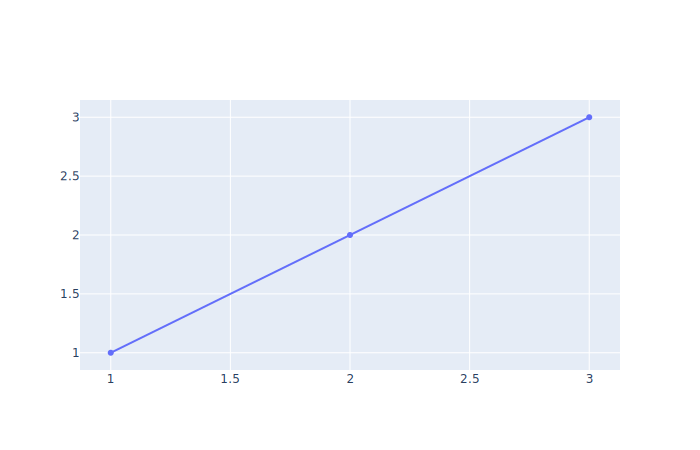
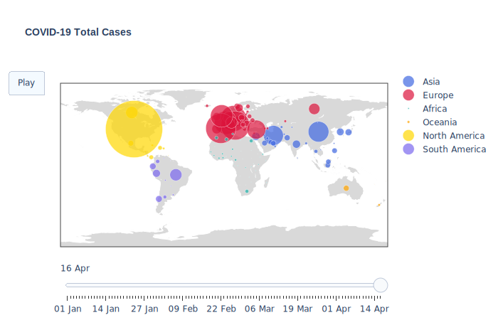

# Plotting the Pandemic with Python and Plotly

#### Create and deploy your own interactive dashboard to monitor the progress of the COVID-19 pandemic with Python, Plotly and Elastic Beanstalk.

Visualizations are a powerful tool for understanding and communicating the meaning within data. The current search for truth and meaning in the daily diet of data on the progress of the COVID-19 pandemic has inspired a number of awesome examples of data visualizations.

This blog details how you can build your own eye-catching interactive charts using the COVID-19 data, wrap them into a dashboard and deploy them to the internet, using open source software. An example can be found [here](www.randomseed42.co.uk). All of the code can be found on [github](https://github.com/LUNDR/covid-19).

The blog is structured into 5 sections, taking you through setup and configuration, to coding of one example vizualization  - an animated map of COVID-19 cases over time - to creating a dash-app ready for deployment:

   1. Setup for coding
   2. Reading-in and wrangling the data
   3. Creating interactive charts with plotly
   4. Creating a dashboard with dash
   5. Deploying your app to AWS Elastic Beanstalk 


### 1.	Setup for coding

#### **Software:**
In the world of data science there are many different permutations of software and operating systems that can be used, depending on resources and taste. As a minimum you will need Python 3.5+ and git for version control. A code editor and a package manager are also recommended. I use the following:
 * Python 3.7
 * Package Manager: Anaconda 4.8.3 
 * Version control: git 
 * Editor: Spyder, Jupyter Lab and Notepad++ 
 * Operating system: Windows 10
    
If you have a different setup, the instructions below won’t vary hugely, but bear in mind that some commands in the terminal may be different and you may need to install additional dependencies.

#### **Version control:** 
It’s good practice to use version control and you’ll need it when you come to deploy. Assuming you’ve got git installed you can do this from the terminal.
    
Open a conda terminal (from the start menu in windows) and make a new directory.Note that if you have a Linux operating system you will need to use a forward slash, rather than a backslash.

```
mkdir .\covid-app
```

Go into that directory.
    
```
cd .\covid-app
```
    
Make a readme file (with a title "Covid-19 app").
    
```
echo "# covid-19 app" >> readme.md
```
    
Start version control.
    
```
git init
```
    
Add the readme file into version control.
    
```
git add readme.md
```
    
Commit the file.
    
```
git commit -m “first-commit”
```
    
(Optional) If you have a github account you can now set up a repository there, and link to it.
    
```
git remote add origin remote repository [repository url] 
git remote -v 
git push origin master 
```
    
Voilà. You are set up for version control.

#### **Create a new environment:**

People forget to do this. Its important because you can end up in a mess when installing packages which conflict with each other. If you’ve done it inside an environment and things go wrong, its easy to close the environment and start again. If you haven’t you can end up with a configuration/uninstall nightmare to unpick.

In the conda terminal create a new environment with a name you'll remember.

``` 
conda create --name [environment-name]
```


Then enter the environment (you’ll have to do this everytime you open a terminal).

``` 
conda activate [environment-name]
```

#### **Configuration:**

Inside your environment you'll need to install several additional packages

``` 
conda install jupyterlab plotly dash palettable 
```

If you don't install jupyterlab then you'll need to seperately install pandas and numpy.

``` 
conda install pandas numpy 
```

To style the app you'll need to install (it's not available through conda).

``` 
pip install dash_bootstrap_components
```

To get plotly charts to display in a **jupyter notebook** you’ll also need a few add-ons, follow the instructions in the [plotly documentation](https://plotly.com/python/getting-started/#jupyterlab-support-python-35)

### 2. Reading-in an wrangling the data

In your covid-19 app folder, create a new .py or ipynb file, and import the data using pandas.
```
import pandas as pd
data = pd.read_csv('https://opendata.ecdc.europa.eu/covid19/casedistribution/csv',
    usecols=list(range(0,10)))
```

The data comes from the European Centre for Disease Prevention and Control, which (at the time of writing) releases daily updates on cases and deaths by country. As with all data you should understand what you are plotting, along with its caveats and limitations. You can read more on their [website](https://www.ecdc.europa.eu/en).

If you take a glance, 

``` 
print(data.head())
```

the data are generally very clean, so luckily there's not much to do. 

#### **Date formats**

However...

``` 
print(data.info()) 
```

...the 'dateRep' columns (which is the date), is not being recognised as a datetime object and is ordered from latest to earliest. If not corrected it will cause us problems later on.

Convert the dates to date-time.

```
data['dateRep'] = pd.to_datetime(data['dateRep'], dayfirst=True)
```

Sort values by country and date.

```
data.sort_values(by=['countriesAndTerritories', 'dateRep'],
                 ascending=True, inplace=True)
```
Reindex the data now its sorted to prevent errors when creating aggregates.

```
data = data.reindex()
```

#### **Create a global aggregate of data**:

We are also interested in a global total of cases and deaths by day, 

``` 
print(data['countriesAndTerritories'].unique()) 
```

but given that this isn't present in the dataset we need to create it.

Create a table of figures aggreagted across all countries.

```
world = data[['dateRep', 'cases', 'deaths',
              'popData2018']].groupby(by='dateRep').sum()

```
Add value for the new 'World' series for each of the columns in data.

```
world['day'] = world.index.day
world['month'] = world.index.month
world['year'] = world.index.year
world['dateRep'] = world.index
world['countriesAndTerritories'] = 'World'
world['geoId'] = 'WD'
world['countryterritoryCode'] = 'WLD'
```
Add the values for world into the original dataset.

```
data = pd.concat([data, world], ignore_index=True)
```
#### **Create cumulative totals for cases and deaths by country**

```
data['total_cases'] = data.groupby(by='countriesAndTerritories')[
    'cases'].cumsum()
data['total_deaths'] = data.groupby(by='countriesAndTerritories')[
    'deaths'].cumsum()
```

#### **Create variables to give a colour according to continent**:

Read-in a file which matches countries to continents via their three letter ISO-3 codes (present in both datasets).

```
continents = pd.read_csv('https://raw.githubusercontent.com/LUNDR/covid-19/master/app/assets/continents.csv')
```

Merge the two files.
```
data = pd.merge(data,
                continents[['Continent_Name',
                            'Three_Letter_Country_Code']].drop_duplicates('Three_Letter_Country_Code'),
                how='left',
                left_on='countryterritoryCode',
                right_on='Three_Letter_Country_Code')
```

Create a colour dictionary to map continents to colours recognised by python (to be used below).
```
colours = {"Asia": "royalblue",
           "Europe": "crimson",
           "Africa": "lightseagreen",
           "Oceania": "orange",
           "North America": "gold",
           "South America": 'mediumslateblue',
           "nan": "peru"}
```

#### **Create a list of dates as strings; needed for creating the animation through time**

```
days_as_dates = data['dateRep'][data['dateRep'] > pd.to_datetime(
    '31-12-2019')].sort_values(ascending=True).unique()
days = [pd.to_datetime(str(x)).strftime('%d %b') for x in days_as_dates]
```

#### **Create a 'date' variable with date as a string**

```
data['date'] = [pd.to_datetime(str(x)).strftime('%d %b')
                for x in data['dateRep']]
```


### 3. Creating interactive charts with plotly

We're now ready to start making some charts. So first lets import plotly's graph_objects library.

```
import plotly.graph_objects as go
```

As with many packages there are multiple ways to do things in plotly, I am only going to show you one.
The high level architecture of a plotly plot is shown below. Basically, you build a 'figure' dictionary which contains:

* A **'data'** element. A list of dictionaries. Each dictionary in the list defines the type (e.g. scatter / bar) of chart and the data to be plotted. Where you want to show multiple series on the same chart (also referred to as traces), you can add further dictionaries to the list.

* (Optional) **'layout'** parameters, to control virutally every aspect of the layout of the chart. You can read more in the plotly [documentation](https://plotly.com/python-api-reference/generated/plotly.graph_objects.Layout.html)

* (Optional) If you are adding any form of animation you will also need to pass a list of dictionaries into the **'frames'** element which  defines what chart should be seen at each frame of the animation.

You then call `go.Figure()` to create the chart.

#### **A basic plotly plot**
```
figure = {
    'data': [{'type' :'scatter', 'x' : [1,2,3], 'y' : [1,2,3]}],
    'layout': {},
    'frames': [],
}

go.Figure(figure)
```
It should look something like this:



#### **Building an animated map of total COVID-19 cases**

Now we can build something a bit more complicated.




Create the 'figure dictionary'.

```
figure = {
    'data': [],
    'layout': {},
    'frames': [],
}
```


#### **The data element**

Decide which day you want to be the default view when the chart is loaded, I've set it to the most recent day.

```
day = days[-1]

```

Create  an empty list to capture the 'data'. As we want each continent to have its own series (colour) on the map we will loop through the continents creating a seperate trace for each.  the 'data_' list captures all of the dictionaries.

```
data_ = []
```

Subset the main dataset, so that its only capturing the day we have chosen.

``` 
chart_data = data[data['date'] == day] 
```

Loop through each continent in the data set (excluding the last one which is 'nan').

```
for i, cont in enumerate(chart_data['Continent_Name'].unique()[:-1]):
```

Define the colour of the series, using the colours dictionary above.
```
    colour = colours[cont]
```    
Further subset the data to only include rows where 'Continent_Name' == cont.

```
    df_sub = chart_data[chart_data['Continent_Name'] == cont].reset_index()
``` 
 
Create the data dictionary for continent == cont at date == day.
```
    data_dict = dict(
        type='scattergeo',
        locationmode='ISO-3',                               # set of location used to translate data onto the map
        locations=df_sub['countryterritoryCode'].tolist(),  # column in the dataset whe ISO-3 values are found
        marker=dict(                                        # dictionary defining parameters of each marker on the figure
            size=df_sub['total_cases'] / 200,               # the size of each marker
            color=colour,                                   # the colour of the marker
            line_color='#ffffff',                           # the outline colour of the marker
            line_width=0.5,                                 # the width of the marker outline
            sizemode='area'),                               # how the size parameter should be translated, area/diameter
        name='{}'.format(cont),                             # series name (appears on the legend)
        text=[                                              # list of text values defining what appears on the label for each country in the series
            '{}<BR>Total Cases: {}'.format(                
                df_sub['countriesAndTerritories'][x],
                df_sub['total_cases'][x]) for x in range(
                    len(df_sub))])
```
Append each the data dictionary for each continent to the 'data' element of the figure dictionary.

```
    figure['data'].append(data_dict)
```

#### **Create Frames and Steps**
As we want to animate this chart over time, we need to define frames. These will be the same chart define above for the data element, but plotted with data for each date in the data set. We will do this by taking the same code as above, but adding an additional loop to loop through days as well. At the same time we will need to capture a list of steps. Steps are layout parameters, which link the frames to the days on the slider and define how you transition between frames.

Create empty lists to capture frames and steps.
```
frames = []
steps = []
```

Loop through days.
```
for day in days:
```
Subset the data by day. 
```
    chart_data = data[data['date'] == day]
```
Create an empty dictionary to capture an individual frame.
```    
    frame = dict(data=[], name=str(day))
```
Loop through continents as above.

```
    for i, cont in enumerate(chart_data['Continent_Name'].unique()[:-1]):
        colour = colours[cont]
        df_sub = chart_data[chart_data['Continent_Name'] == cont].reset_index()
        data_dict = dict(
            type='scattergeo',
            locationmode='ISO-3',
            locations=df_sub['countryterritoryCode'].tolist(),
            marker=dict(
                size=df_sub['total_cases'] / 200,
                color=colour,
                line_color='#ffffff',
                line_width=0.5,
                sizemode='area'),
            name='{}'.format(cont),
            text=[
                '{}<BR>Total Cases: {}'.format(
                    df_sub['countriesAndTerritories'][x],
                    df_sub['total_cases'][x]) for x in range(
                    len(df_sub))])
```
At the end of each inner loop append the data dictionary to the frame dictionary created above.

```
        frame['data'].append(data_dict)
        
```
In each outer loop append the frame dictionary to the 'frames' element of the figure dictionary.

```
    figure['frames'].append(frame)
```
    
In each outer loop create a 'step' dictionary.

```
    step = dict(                                    
        method="animate",                          # how the transition should take place - should the chart be redrawn?
        args=[
            [day],                                 # should match the frame name                                                  
            dict(frame=dict(duration=100,          # speed and style of the transitions
                            redraw=True),
                 mode="immediate",
                 transition=dict(duration=100,
                                 easing="quad-in"))
        ],
        label=day,                                  # name of the step

    )

``` 

At the end of the outer loop append step to steps list.

```
    steps.append(step)
```

#### **Create and add a slider**
Now we've got the steps we need to add a slider. This is done by creating a dictionary, which is an argument of the 'layout' dictionary for the whole figure.

Create a sliders dictionary.

```
sliders = [dict(
    y=0,
    active=len(days) - 1,
    currentvalue=dict(prefix="",
                      visible=True,
                      ),
    transition=dict(duration=300),
    pad=dict(t=2),
    steps=steps                                     # the list of steps is included here
)]

```
#### **Layout**
Finally we need to define the layout, first we define a few parameters that we want to be consistent across charts.

```

title_font_family = 'Arial'
title_font_size = 14

```
Then we create a dictionary for the layout.
```

figure['layout'] = dict(
    titlefont=dict(                                  # parameters controlling title font
        size=title_font_size,
        family=title_font_family),
    title_text='<b> COVID-19 Total Cases </b> <BR>', # Chart Title
    showlegend=True,                                 # Include a legend
    geo=dict(                                        # parameter controlling the look of the map itself
        scope='world',
        landcolor='rgb(217, 217, 217)',
        coastlinecolor='#ffffff',
        countrywidth=0.5,
        countrycolor='#ffffff',
    ),
    updatemenus=[                                     # Where a 'play' button is added to enable the user to start the animation
        dict(
            type='buttons',
            buttons=list(
                [
                    dict(
                        args=[
                            None,
                            dict(
                                frame=dict(
                                    duration=200,
                                    redraw=True),
                                mode="immediate",
                                transition=dict(
                                    duration=200,
                                    easing="quad-in"))],
                        label="Play",
                        method="animate")]))],
    sliders=sliders)                                   # Add the sliders dictionary
```

Finally we need to create the whole visualtisation, which we're going to save a map1.

```
    map1 = go.Figure(figure)
    
```

The whole map code should look like this:

```
figure = {
    'data': [],
    'layout': {},
    'frames': [],
}


day = days[-1]
data_ = []
chart_data = data[data['date'] == day]
for i, cont in enumerate(chart_data['Continent_Name'].unique()[:-1]):
    colour = colours[cont]
    df_sub = chart_data[chart_data['Continent_Name'] == cont].reset_index()
    data_dict = dict(
        type='scattergeo',
        locationmode='ISO-3',                               # set of location used to translate data onto the map
        locations=df_sub['countryterritoryCode'].tolist(),  # column in the dataset whe ISO-3 values are found
        marker=dict(                                        # dictionary defining parameters of each marker on the figure
            size=df_sub['total_cases'] / 200,               # the size of each marker
            color=colour,                                   # the colour of the marker
            line_color='#ffffff',                           # the outline colour of the marker
            line_width=0.5,                                 # the width of the marker outline
            sizemode='area'),                               # how the size parameter should be translated, area/diameter
        name='{}'.format(cont),                             # series name (appears on the legend)
        text=[                                              # list of text values defining what appears on the label for each country in the series
           '{}<BR>Total Cases: {}'.format(                
                df_sub['countriesAndTerritories'][x],
                df_sub['total_cases'][x]) for x in range(
                    len(df_sub))])
    figure['data'].append(data_dict)

frames = []
steps = []
for day in days:
    chart_data = data[data['date'] == day]
    frame = dict(data=[], name=str(day))
    for i, cont in enumerate(chart_data['Continent_Name'].unique()[:-1]):
        colour = colours[cont]
        df_sub = chart_data[chart_data['Continent_Name'] == cont].reset_index()
        data_dict = dict(
            type='scattergeo',
            locationmode='ISO-3',
            locations=df_sub['countryterritoryCode'].tolist(),
            marker=dict(
                size=df_sub['total_cases'] / 200,
                color=colour,
                line_color='#ffffff',
                line_width=0.5,
                sizemode='area'),
            name='{}'.format(cont),
            text=[
                '{}<BR>Total Cases: {}'.format(
                    df_sub['countriesAndTerritories'][x],
                    df_sub['total_cases'][x]) for x in range(
                    len(df_sub))])
        frame['data'].append(data_dict)
    figure['frames'].append(frame)

    step = dict(                                    
        method="animate",                          # how the transition should take place - should the chart be redrawn?
        args=[
            [day],                                 # should match the frame name                                                  
            dict(frame=dict(duration=100,          # speed and style of the transitions
                            redraw=True),
                 mode="immediate",
                 transition=dict(duration=100,
                                 easing="quad-in"))
        ],
        label=day,                                  # name of the step

    )

    steps.append(step)
    
    
sliders = [dict(
    y=0,
    active=len(days) - 1,
    currentvalue=dict(prefix="",
                      visible=True,
                      ),
    transition=dict(duration=300),
    pad=dict(t=2),
    steps=steps                                     # the list of steps is included here
)]


title_font_family = 'Arial'
title_font_size = 14


figure['layout'] = dict(
    titlefont=dict(                                  # parameters controlling title font
        size=title_font_size,
        family=title_font_family),
    title_text='<b> COVID-19 Total Cases </b> <BR>', # Chart Title
    showlegend=True,                                 # Include a legend
    geo=dict(                                        # parameter controlling the look of the map itself
        scope='world',
        landcolor='rgb(217, 217, 217)',
        coastlinecolor='#ffffff',
        countrywidth=0.5,
        countrycolor='#ffffff',
    ),
    updatemenus=[                                     # Where a 'play' button is added to enable the user to start the animation
        dict(
            type='buttons',
            buttons=list(
                [
                    dict(
                        args=[
                            None,
                            dict(
                                frame=dict(
                                    duration=200,
                                    redraw=True),
                                mode="immediate",
                                transition=dict(
                                    duration=200,
                                    easing="quad-in"))],
                        label="Play",
                        method="animate")]))],
    sliders=sliders)                                   # Add the sliders dictionary

map1 = go.Figure(figure)
```

So far we've read-in the data, added some additional features and created an interactive and animated chart. But it's all still running only in our code editor/terminal. Now we need to prepare for deployment.

### 4. Creating a dashboard with dash

Once you've created one or more figures, you can use dash to pull them together into a dashboard
Dash provides a flask wrapper for html, css and javascript compatible with plotly charts, to make creating and deploying a dashboard easier.

First, import the relevant packages.

```
import dash
import dash_core_components as dcc
import dash_html_components as html
```

Create a basic dash-app.
```
app = dash.Dash()
app.layout = html.Div([
    dcc.Graph(figure=map1)
])

app.run_server(debug=True, use_reloader=False)  # Turn off reloader if inside Jupyter

``` 
If you've created *map1* and run the code below you should get a message. 

```
Running on http://127.0.0.1:8050/
Debugger PIN: 192-986-080
 * Serving Flask app "__main__" (lazy loading)
 * Environment: production
   WARNING: This is a development server. Do not use it in a production deployment.
   Use a production WSGI server instead.
 * Debug mode: on
 ```

This means your dashboard is up and running locally. If you paste that into a browser window you will see your chart.

##### **Creating more complex dashboards**

You can add more charts to your dashboard, by including further 'html.Div' terms. 

```
app = dash.Dash()
app.layout = html.Div(children=[
    html.Div(
        dcc.Graph(
            figure= map1,
            style={'width': '800'}
        ), style={'display': 'inline-block'}),
    html.Div(
        dcc.Graph(
            figure=fig2,
            style={'width': '800'}
        ), style={'display': 'inline-block'}),
    
    html.Div(
        dcc.Graph(
            figure=fig3,
            style={'width': '800'}
        ), style={'display': 'inline-block'}),

    html.Div(
        dcc.Graph(
            figure=fig4,
            style={'width': '800'}
        ), style={'display': 'inline-block'})
])
app.run_server(debug=True, use_reloader=False) 

```
You can also style your dashboard, by including css styling parameters as shown above in the "style" dictionaries. You can also import ready made style sheets by updating the initial app definition.

```
import dash_bootstrap_components as dbc

external_style_sheet = dbc.themes.BOOTSTRAP

app = dash.Dash(external_stylesheets=[external_style_sheet])
```
More complex styling of your app will lead you into HTML and CSS; if you're not familiar with these, there's tons of good explanations out there such as [W3 school](https://www.w3schools.com/html/) and its pretty easy to add elements incrementally in the dash framework. 

### 5. Deploying your app to AWS Elastic Beanstalk 

Now that you've created your app you want other people to be able to see the fruits of your creative genius. You want to make it available via the internet. Again there are many routes to do this. I chose elastic beanstalk because of its flexibility and scaleability. With a simple dashboard (like this one) you can quite happily deploy to heroku or Amazon s3. However, if you are thinking of building something more complex that takes user input (and so requires call backs) then elastic beanstalk is going to be better; particularly if you're expecting lots of traffic.

#### **Organise your file structure**
Before deployment you will need to create an 'app' subfolder in the covid19-app directory folder which contains the following:

    * application.py  - containing the dash app code. Note this must be called 'application.py' NOT app.py or anything else
    * figures.py  - containing the code for the charts. The code for creating charts can be put at the top of the applications file, but I find it neater to seperate them out and it makes debugging easier.
    * requirements.txt - contains the python packages that will need to be installed on the elastic beanstalk instance
    * assets/ -  A folder containing any images, css files and supplementary data

#### **Update your application.py file**
The application code needs to look a bit different for deployment. Note the addition of `application = app.server` and the changes to the last two lines.

```

# for dash app
    import dash
    import dash_core_components as dcc
    import dash_html_components as html
    import dash_bootstrap_components as dbc


    
    app = dash.Dash(__name__, external_stylesheets=[dbc.themes.BOOTSTRAP])
    application = app.server
    
    app.layout = html.Div([
        dcc.Graph(figure=map1)
    ])

    if __name__ == '__main__':
        application.run(port=8080)
```

If you have seperated out your charts into figures.py you will also need to import them into the application.py.

```
from figures import map1
```

##### **Create a requirements.txt file**

The file should look like this:

```
numpy
pandas
plotly
palettable
dash
dash_bootstrap_components
```


##### **Make an AWS account**

If you don't have an AWS account, then you need to make one at https://aws.amazon.com/. I suggest following the instructions in this [blog](https://medium.com/@miloharper/a-beginner-s-guide-to-creating-your-first-python-website-using-flask-aws-ec2-elastic-beanstalk-6a82b9be25e0), from step 27 onwards.

##### **Install the AWS client**
Next you will need to download the eb client. From your terminal, run:

``` 
pip install awsebcli --upgrade --user
```

#### **Initialize your environment**

Make sure you are in your covid19-app/app folder, then in the terminal, type:

``` 
eb init
```

When prompted choose a region near you. Accept the defaults, including the python version -  Even though I run python 3.7 locally, I needed to choose 3.6 for Elastic Beanstalk. When asked it you want to set up ssh select 'no'. When it asks if you want to use 'CodeCommit' also select 'no'.

#### **Commit your files**
Next ensure all folders and files in the app folder are committed.

```
git add .
git commit -m "commit in preparation from deploy"
````
#### **Create an instance of your app in the environment**

```
eb create
```
Accept the defaults, and then wait a while for the app to create. Once it is done, you should see amongst the terminal output something that looks like:

```
CNAME:http://covid-app-dev.eu-west-2.elasticbeanstalk.com/

```

Paste that link into your browser, and you should see your app appear.

#### **Update your app**

If you make changes to the app code, simply git add, git commit and then type

``` 
eb deploy 
```

And your app will update.

#### **Nothing ever goes that smoothly**

If you see an error rather than your app, you can check the logs.

``` 
eb logs
```

The logs will point to errors in the code (w often missing commas or unmatched parentheses!) and help you debug.

#### **That's all there is to it!**
That's it, you are up and running. Now there's time to spend endless hours styling and creating new charts.

**References:**

* https://medium.com/@miloharper/a-beginner-s-guide-to-creating-your-first-python-website-using-flask-aws-ec2-elastic-beanstalk-6a82b9be25e0
* https://medium.com/@austinlasseter/plotly-dash-and-the-elastic-beanstalk-command-line-89fb6b67bb79